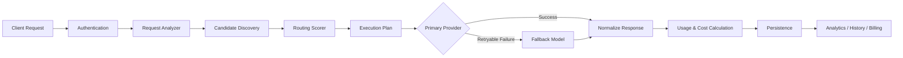

# Attentra

### Intelligent LLM routing for cost-efficient, transparent AI infrastructure

**Attentra analyzes every request, evaluates eligible models, routes it to the best-fit LLM, executes it through the provider, and records the decision, cost, latency, and savings — through one unified API.**

[Live Demo](https://attentra-nine.vercel.app/) · [GitHub](https://github.com/hasnain0122E/Attentra)

---

## Why Attentra?

Modern AI products rarely have a single “best” model.

A simple classification request may not need an expensive frontier model, while a complex reasoning or coding task may require stronger capability. Using one model for every request can increase cost, reduce flexibility, and make AI spend difficult to understand.

Attentra adds an intelligent routing layer between an application and multiple LLM providers.

```text
Application
    │
    ▼
Attentra API
    │
    ├── Analyze request
    ├── Estimate complexity
    ├── Discover eligible models
    ├── Score candidates
    ├── Select best-fit model
    ├── Execute with fallback support
    └── Persist routing + cost telemetry
    │
    ▼
OpenAI · Anthropic · Google
```

Instead of asking developers to manually choose a model for every request, Attentra makes that decision dynamically.

---

## Core Features

### Intelligent Model Routing
Requests are analyzed by task type and complexity before eligible models are ranked using capability, projected cost, context fit, and routing criteria.

### Multi-Provider Execution
A provider-agnostic execution layer currently supports direct integrations with:

- OpenAI
- Anthropic
- Google Gemini

The underlying architecture remains extensible for additional providers.

### Automatic Fallbacks
If the primary execution fails with a retryable provider error, Attentra can continue through its fallback execution plan while preserving attempt telemetry.

### Dynamic Model Registry & Pricing
Attentra maintains model and pricing information in the database and uses current registry data during routing and cost calculations rather than hard-coding model selection into the application.

### Cost Intelligence
For successfully costed requests, Attentra can compare actual execution cost against a configured baseline model using the same token usage.

This enables:

- actual provider spend
- baseline-equivalent spend
- signed savings
- savings percentage
- comparable-request coverage
- model-level spend analytics
- time-based cost trends

### Transparent Routing Decisions
Attentra does not only return an answer. It exposes why and how the request was handled:

- detected task
- complexity
- ranked candidates
- selected model
- routing score
- projected cost
- executed provider/model
- attempts
- token usage
- latency
- actual cost

### Consumer Workspace
Individual users get a production dashboard with:

- Playground
- Request history
- Request detail and routing trace
- Personal API keys
- Cost intelligence
- Billing analytics
- Model activity
- Routing health

### Business Workspace
Organizations receive a separately scoped workspace with:

- business API keys
- organization-level request analytics
- member management
- baseline model configuration
- cost intelligence
- billing analytics
- routing health
- request history

---

## Production Routing Flow



The public API route remains thin: routing, provider execution, fallback behavior, normalization, and persistence are handled by dedicated backend layers.

---

## Live Production Example

A production smoke test through the deployed Attentra Playground successfully processed:

```text
Prompt:
Reply exactly: Attentra production works
```

Attentra:

```text
Task                 GENERAL
Complexity           LOW
Eligible candidates  49
Routed model         Gemini 3.1 Flash Lite
Executed provider    Google
Execution attempts   1
Input tokens         8
Output tokens        4
Total tokens         12
Latency              ~3.93 s
Response             Attentra production works
```

This verifies the deployed flow from authenticated Playground request → analysis → candidate ranking → routing → provider execution → telemetry → persistence.

---

## API

Attentra exposes an OpenAI-style production endpoint:

```http
POST /api/v1/chat/completions
```

Example:

```bash
curl -X POST "https://attentra-nine.vercel.app/api/v1/chat/completions" \
  -H "Content-Type: application/json" \
  -H "Authorization: Bearer atr_your_api_key" \
  -d '{
    "messages": [
      {
        "role": "user",
        "content": "Explain vector databases in simple terms."
      }
    ]
  }'
```

Attentra chooses the model automatically. Applications integrate with Attentra rather than hard-coding a provider/model decision for each request.

> Never commit real Attentra or provider API keys to source control.

---

## Authentication & API-Key Security

Attentra supports Google OAuth for the web application and scoped API keys for programmatic access.

API keys follow a secure storage model:

```text
Raw key generated
      ↓
Shown to user once
      ↓
SHA-256 hash stored
      ↓
Raw key is never persisted
```

Personal and business API keys have separate ownership semantics. Business membership and role authorization remain server-side.

---

## Cost & Billing Model

Attentra keeps provider usage and optimization economics separate.

```text
Baseline-equivalent cost
        −
Comparable actual provider cost
        =
Verified savings
```

For the production billing foundation:

```text
Billable savings = max(verified savings, 0)

Attentra optimization fee = 10% × billable savings

Customer retained savings = 90% × billable savings
```

Overspending comparable requests offset savings within the billing period before the optimization fee is calculated.

All canonical calculations are performed in USD. The current product UI presents monetary values in PKR through a centralized display-currency layer.

---

## Tech Stack

| Layer | Technology |
|---|---|
| Framework | Next.js 14 · React · TypeScript |
| Styling | Tailwind CSS |
| Motion / UI | Framer Motion · Phosphor Icons |
| Authentication | Auth.js / NextAuth v5 · Google OAuth |
| Database | PostgreSQL · Neon |
| ORM | Prisma |
| AI Providers | OpenAI · Anthropic · Google Gemini |
| Validation / Testing | TypeScript · Vitest |
| Deployment | Vercel |

---

## Architecture

The backend is intentionally separated into focused layers.

```text
Client / SDK
     │
     ▼
API + Authentication
     │
     ▼
Request Analysis
     │
     ▼
Model Registry
     │
     ▼
Candidate Scoring
     │
     ▼
Routing Decision
     │
     ▼
Execution Orchestrator
     │
     ├──── OpenAI
     ├──── Anthropic
     └──── Google
     │
     ▼
Normalized Result
     │
     ▼
Cost Intelligence
     │
     ▼
PostgreSQL
     │
     ├──── Consumer Dashboard
     └──── Business Dashboard
```

The provider layer is abstracted so routing logic does not depend on provider-specific request/response formats.

---

## Request Ownership

Attentra supports three request identities:

| Request source | `userId` | `businessId` | `apiKeyId` |
|---|---:|---:|---:|
| Consumer session | ✓ | — | — |
| Personal API key | ✓ | — | ✓ |
| Business API key | — | ✓ | ✓ |

This allows consumer analytics and business analytics to remain correctly isolated while using the same routing/execution infrastructure.

---

## Reliability & Persistence

Attentra separates pre-execution persistence from post-execution telemetry.

Before a paid provider call, core routing persistence must succeed. If the request or routing ownership cannot be persisted, execution is stopped.

After provider execution, telemetry persistence is best-effort so a database logging issue does not incorrectly encourage a client to retry an already-paid provider request.

This reduces the risk of duplicate paid LLM executions while keeping routing history auditable.

---

## Local Development

### 1. Clone

```bash
git clone https://github.com/hasnain0122E/Attentra.git
cd Attentra
```

### 2. Install dependencies

```bash
npm install
```

### 3. Configure environment

Create `.env.local` from the repository's `.env.example` and configure your own credentials.

Typical configuration includes:

```env
DATABASE_URL=
AUTH_SECRET=
GOOGLE_CLIENT_ID=
GOOGLE_CLIENT_SECRET=

OPENAI_API_KEY=
ANTHROPIC_API_KEY=
GOOGLE_AI_API_KEY=

CRON_SECRET=
CONSUMER_BASELINE_MODEL=

NEXT_PUBLIC_DISPLAY_CURRENCY=
NEXT_PUBLIC_USD_TO_PKR_RATE=
```

Do **not** enable live-provider tests unless you intentionally want tests to make real provider calls.

### 4. Prisma

```bash
npx prisma generate
```

Apply the database workflow appropriate to your environment before starting the application.

### 5. Start development

```bash
npm run dev
```

Open:

```text
http://localhost:3000
```

---

## Validation

The current deployment-ready codebase has been validated with:

```text
Full test suite    952 passed / 4 skipped
TypeScript         0 errors
Production build   Successful
```

Live-provider tests are explicitly gated to avoid accidental API-credit consumption.

---

## Deployment

Attentra is currently deployed on Vercel:

**https://attentra-nine.vercel.app/**

The production deployment uses:

- Vercel serverless functions
- Edge-safe authentication middleware
- Neon PostgreSQL
- Google OAuth
- direct provider API integrations
- scheduled pricing synchronization

The middleware authentication configuration is separated from Prisma-backed server authentication so Node-only database dependencies are not bundled into the Vercel Edge middleware.

---

## Project Status

Attentra is an active engineering project and hackathon build.

Current implemented foundation:

**Routing engine → provider execution → fallback orchestration → dynamic model registry → pricing intelligence → persistence → consumer workspace → business workspace → API keys → cost intelligence → billing analytics → production deployment**

Future work can extend the platform with richer routing evaluation, additional provider integrations, production observability, SDKs, configurable policies, and commercial billing infrastructure.

---

## Built By

**Hasnain Ali**

Software Engineering student and AI/ML engineer focused on building practical AI systems and developer infrastructure.

[GitHub](https://github.com/hasnain0122E) · [LinkedIn](https://www.linkedin.com/in/hasnainali7867/)

---

<p align="center">
  <strong>Attentra</strong><br/>
  Route intelligently. Understand every decision. Optimize AI spend.
</p>
